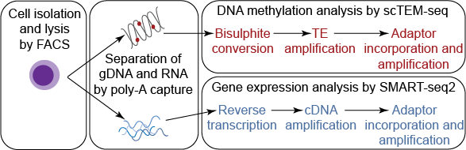

scTEM-seq
=========
This repo contains the scripts and relevant protocol information to support researchers to perform scTEMseq which is explained step-by-step with the release of the ['Protocol for targeted analysis of transposable element methylation levels and transcriptome in single cells using scTEM-seq'](https://www.nature.com/articles/s41598-022-09765-x). The focus of this repo is on 'how to' obtain the global methylation level from samples and not the processing and analysis of the expression data, as many labs already have their own preference for processing and analysing RNAseq data. At the end of this readme file is an example of the benefit of combining the global methylation level with the RNAseq data.


<p align="center">
 ​
</p>

For more details, you can also read the original methods publications [https://www.nature.com/articles/s41598-022-09765-x](https://www.nature.com/articles/s41598-022-09765-x) and associated protocol manuscript. []()


Content:
--------
* `/Annotations/`: Contains a 'ready to use' example SINE.Alu annotation. However, we recommend ensuring the download of an up-to-date assembly annotation. We have provided a script to automate the download and filtering.
* `/examples/`: Four example cov files and Coverage summary table.
* `/Processing/`: Contains additional details and example scripts for processing the fastq files into coverage files (steps 127-131 in the protocol paper)
* `/Protocol_related_material/`: This contains information directly related to the library prep steps leading up to the sequencing run.
* `/scripts/`: R scripts with functions to obtain an up-to-date and filtered SINE-Alu annotation file, and create coverage summary files from the cov files produced by scTEM-seq.

N.B. The coverage summary script can also be used to obtain methylation levels in other genomic contexts as long as the annotation file used is in the same format (with the same headers) as the example SINE-Alu annotation file provided here.

How to:
--------
Once you have obtained the coverage files (.cov) files following the sequencing and processing steps in the [scTEMseq protocol]() or [Processing subdirectory](Processing/Readme.md), you can obtain the global methylation estimates and additional QC information by following the steps below.


#### STEP 1: Create a (SINE-Alu) annotation file.
The cov summary scripts can work without the annotation file, but it's advised to use one to provide additional QC metrics. Additionally, the coverage summary script can be used on any '.cov' file to obtain methylation levels in other genomic contexts, as long as the annotation file used contains the minumum column names 'chr', 'start' and 'end'. This should be a text file (comma separated) with one element per line.


#### STEP 1A: Download annotation file:
This can be done using the R script provided, or downloaded directly for USCS : https://hgdownload.cse.ucsc.edu/goldenPath/hg38/bigZips/latest/hg38.fa.out.gz
```
source("./scripts/Create_SINE.Alu_anno_function.R")

Download.Annotation(URL = "https://hgdownload.cse.ucsc.edu/goldenPath/hg38/bigZips/latest/hg38.fa.out.gz",
  annotation.dir = "./Annotations/")
  ```
#### STEP 1B: Filter annotation file for SINE-Alu elements:
```
source("./scripts/Create_SINE.Alu_anno_function.R")
Create.Filtered.Annotation(anno.file = "./Annotations/hg38.fa.out.gz",
                           annotation.dir = "./Annotations/",
                           filtered.anno.name = "SINE.Alu.anno.txt")
```

#### STEP 2: Run cov summary script:
```
source("./scripts/scTEMseq_cov_summary.R")
```
This can be done without the annotation file, but it is advised to use the annotation file to obtain additional QC metrics.
```
scTEMseq_cov_summary(cov.dir = "./examples/",  
                     output.dir = "", # By default, the output will be the 'cov.dir'.
                     cov.suffix = "cov.gz",
                     SINE.Alu.anno = "NULL",
                     run.parallel = FALSE)
```
Using the annotation file can be looped sequentially (using one-core) or run in parallel to speed the process up if you have a lot of samples:
```
scTEMseq_cov_summary(cov.dir = "./examples/",  
                     output.dir = "", # By default, the output will be the 'cov.dir'.
                     cov.suffix = "cov.gz",
                     SINE.Alu.anno = "./Annotations/SINE.Alu.anno.txt",
                     run.parallel = FALSE)
```
Change parallel to 'TRUE' if you have a lot of samples (>300). In theory, this should work across both UNIX and windows machines, but has currently only been tested on windows OS. By default, it will use 1 core less than is totally available. Adjust the script as required to further optimise or if it has difficulties running on your machine.
```
scTEMseq_cov_summary(cov.dir = "./examples/",  
                     output.dir = "", # By default, the output will be the 'cov.dir'.
                     cov.suffix = "cov.gz",
                     SINE.Alu.anno = "./Annotations/SINE.Alu.anno.txt",
                     run.parallel = TRUE)
```

Output:
--------
This produces a tab-deliminated text file which contains the columns:
*   sample_id
*   Number_of_cytosines
*   Average_methylation
*   Percent_digital
*   Number_of_SINE_Alu_annotations
*   Number_of_cytosines_in_SINE_Alu_annotations
*   Percent_cytosines_in_SINE_Alu_annotations
*   Number_of_duplicated_cytosines_in_coverage_file
*   Mean_methylation_across_SINE_Alu_only

N.B. The cov_summary script can also be used to measure cytosines and obtain methylation levels across different regions (other than SINE-Alu), as long as the annotation file used contains the specified columns above. If this is done, it is recommended to rename the last columns in the text file as they currently defaulted to 'SINE.Alu'. A feature release may automate this process if there's enough use/interest.


Example of combining the global methlyation level with expression signature:
--------
This is to get people a bit more excited/invested in the idea of using scTEM-seq!

CORRELATION

HEATMAP
<p align="center">
​
</p>


Data:
--------
The raw data is accessible at GEO [GSE171029](https://www.ncbi.nlm.nih.gov/geo/query/acc.cgi?acc=GSE171029).


Acknowledgements/Contact:
--------
Computational analysis:  
Experimental protocol:
